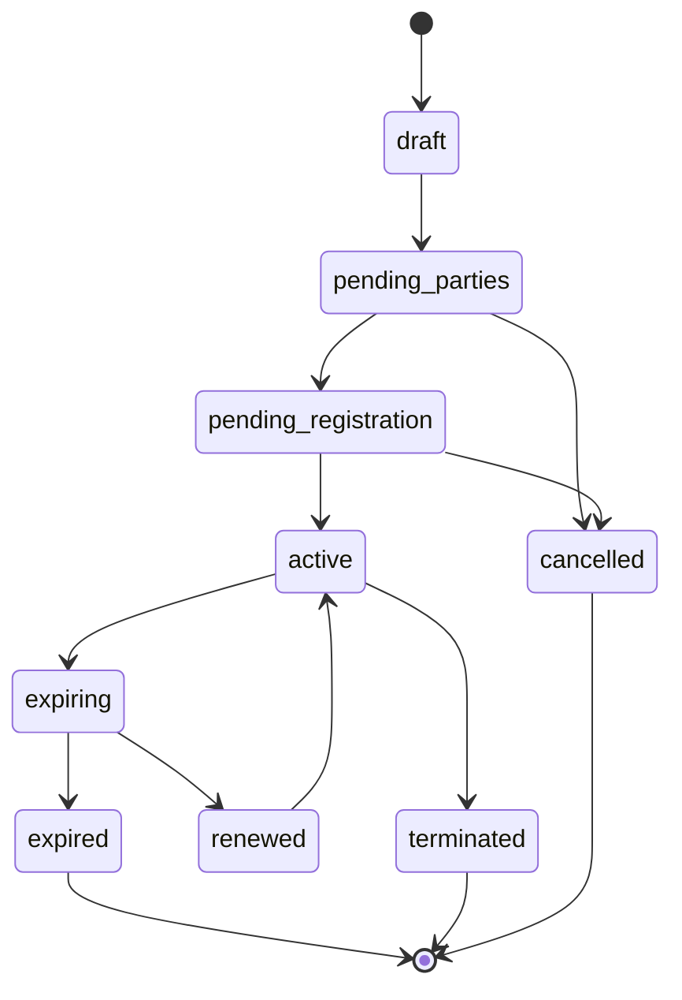
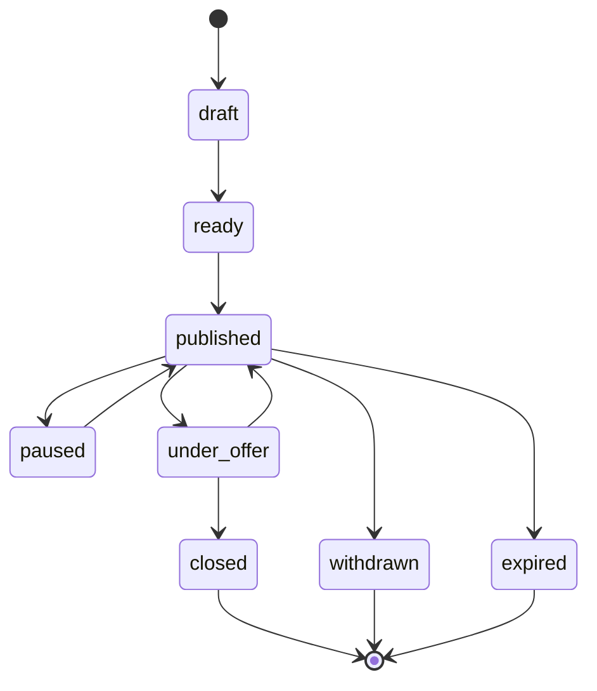
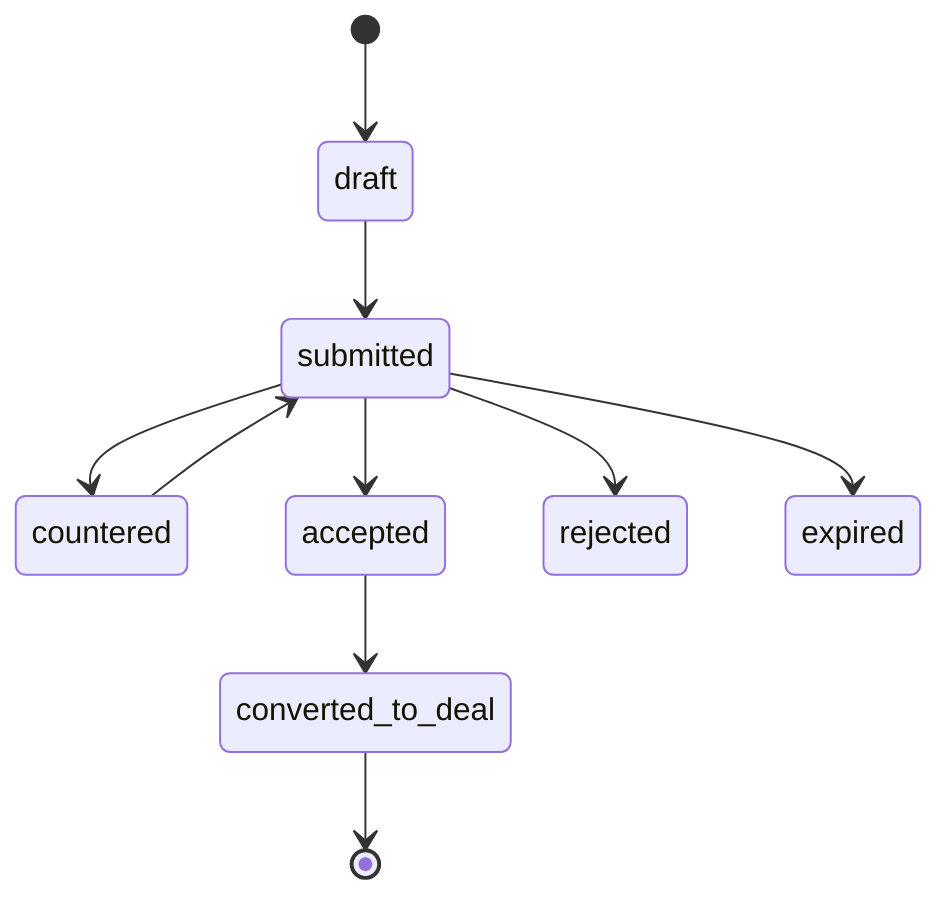
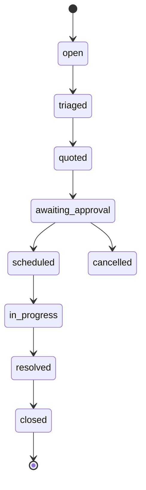
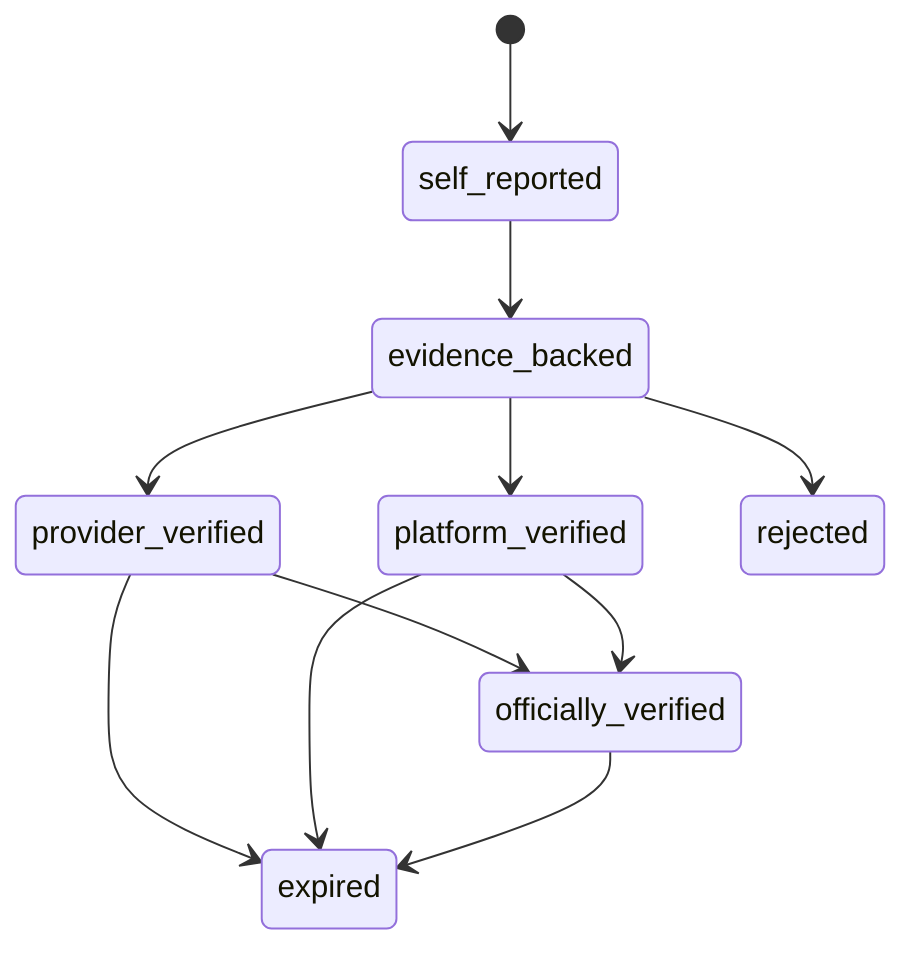
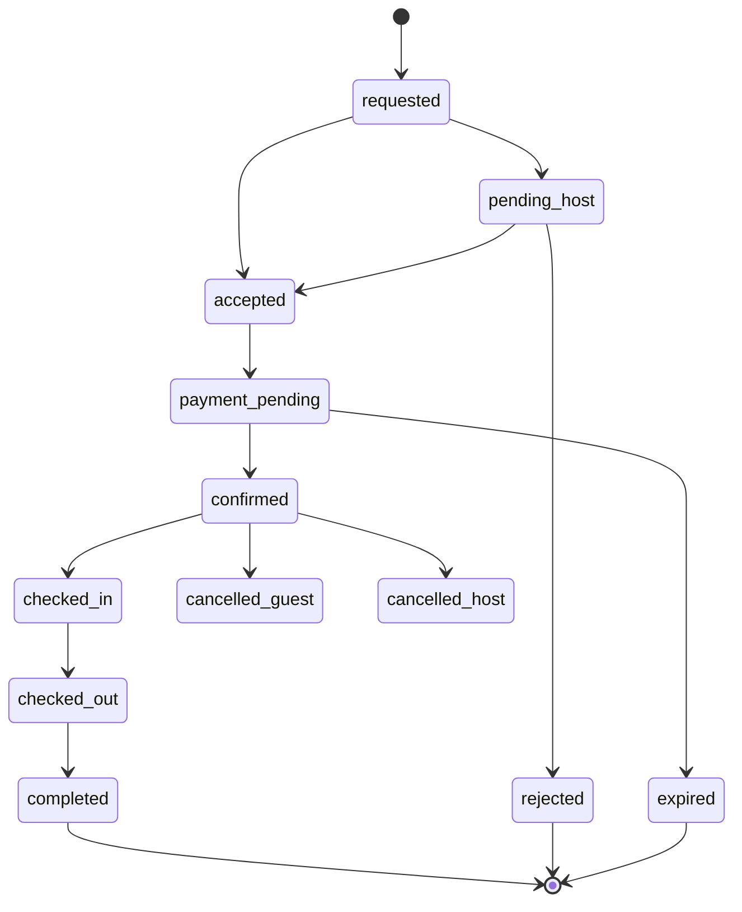
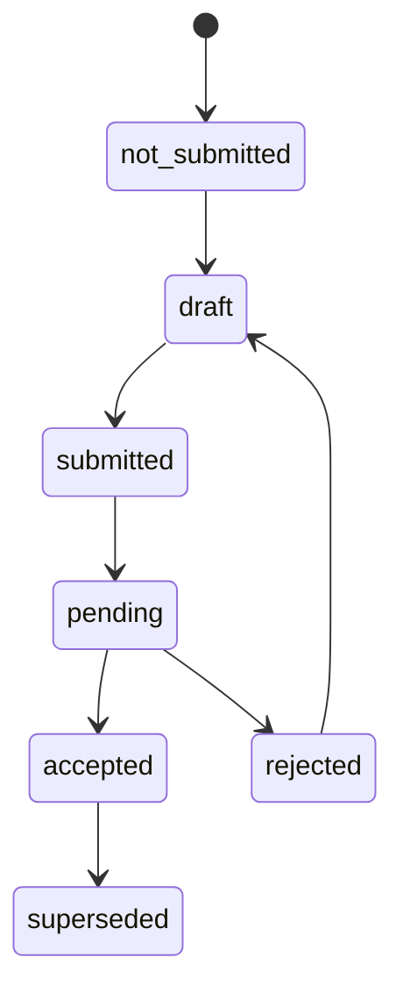

# Property OS — State Machines v1

Status: WORKING

## Lease

Rules:
- Terms snapshot becomes immutable after all-party signature.
- External registration state is related but separate.
- Renewal creates a new term/version rather than silently overwriting historical dates.

## Listing

## Offer

Each counter should be a version/event, not mutation without history.

## Maintenance

## Verification

Verification **level** and verification **decision** should be separate fields if the workflow needs rejected/expired states.

## Reservation

Instant booking may skip pending_host.

## Official registration adapter

Never infer "officially verified" merely because submission succeeded locally.
